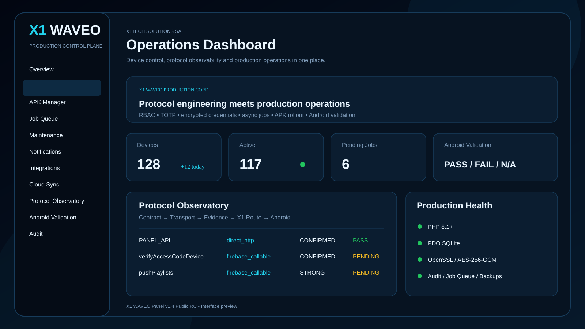

# X1 WAVEO Panel

**X1 WAVEO Panel v1.4 Public RC** is a production-oriented control plane for WAVEO-compatible deployments.

It combines device operations, APK release management, Cloud Sync, pairing, premium workflows, Remote Activation routing, security controls, observability and Android validation in one panel.

## Public source

The conservatively minified public source is available in [`src/`](src/).

The GitHub layout splits the minified core into several `lib/core_parts/` files only to keep the public repository manageable. The split public layout was syntax-validated successfully: **72/72 PHP files PASS**.

Private APK signing keys, internal reverse-engineering notes and development-only patch tooling are **not** published.

There is no `eval` or base64 runtime loader in the public PHP application.

## Main capabilities

- Device Control with status, groups, tags, premium state and application metadata
- Portal management and direct `PANEL_API` compatibility
- Premium access and checkout workflows
- Companion pairing and Cloud Sync
- Revision, snapshot and conflict tracking
- Remote Activation routing and ACK handling
- Firebase Callable-compatible X1 router
- APK Manager with stable / beta / canary channels
- staged rollout, pause and rollback state
- Owner / Admin / Operator / Read Only RBAC
- TOTP 2FA
- encrypted provider credentials using AES-256-GCM
- asynchronous job queue and CLI worker
- Maintenance Scheduler
- Notification Center
- Telegram, Discord and generic HTTPS webhooks
- optional HMAC-SHA256 webhook signing
- versioned backups
- hash-chained audit events
- API observability
- Protocol Observatory
- Android Validation registry with PASS / FAIL / N/A / PENDING states

## Production requirements

- PHP 8.1+
- PDO SQLite
- OpenSSL
- cURL recommended for integrations
- HTTPS
- writable `storage/` and `uploads/`
- configured `X1_APP_KEY`

## Installation

1. Copy `src/` to the target web directory.
2. Copy `.env.example` to `.env` and configure a strong `X1_APP_KEY`.
3. Ensure `storage/`, `uploads/` and the PHP user permissions are correct.
4. Open `install.php` and create the first Owner account.
5. Run `php bin/worker.php 25` from cron/systemd for queued operations.

## Compatibility & support

X1 WAVEO is actively maintained against the WAVEO client contracts and routing behavior implemented by this project.

Compatibility can vary with application versions, Android devices, server configuration and upstream behavior. If a specific flow behaves differently in a real deployment, open a report with the affected feature, app version and device details so it can be reproduced, corrected and included in a subsequent update.

The panel includes Protocol Observatory and Android Validation tooling specifically to make compatibility issues measurable and easier to fix instead of hiding them.

## Community

- Telegram: https://t.me/+XkuQS_QuD6g4Nzc0
- Discord: https://discord.gg/vSSw6jHmw
- Forum: https://forum.x1panel.space

Copyright © 2026 X1Tech Solutions SA. All Rights Reserved.
