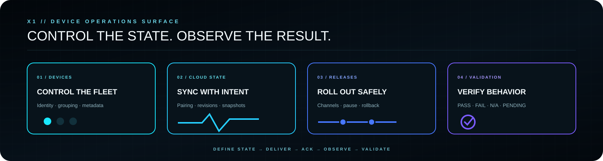

  

  <strong>PUBLIC · COMMUNITY · RELEASE CANDIDATE</strong> 
  Device operations, release control, cloud-state workflows, observability and Android validation.

  <a href="https://x1panelhq.com"><strong>WEBSITE</strong></a>
  &nbsp;·&nbsp;
  <a href="https://forum.x1panelhq.com"><strong>FORUM</strong></a>
  &nbsp;·&nbsp;
  <a href="https://discord.gg/vSSw6jHmw"><strong>DISCORD</strong></a>
  &nbsp;·&nbsp;
  <a href="https://t.me/+XkuQS_QuD6g4Nzc0"><strong>TELEGRAM</strong></a>

---

## X1 WAVEO Panel

**X1 WAVEO Panel v1.4 Public RC is a public X1 control-plane project for WAVEO-compatible deployments.**

> **Free means functional.**
> The public source is intended to be useful as released while the RC label remains an explicit statement about validation maturity.

WAVEO brings device operations, release management, pairing, cloud-state workflows, security controls, observability and Android validation into one self-hosted operational surface.

  

---

  

## Release status

**Public RC means Public RC.**

The repository contains public source under `src/` and is presented as a **Release Candidate**, not as a blanket production guarantee for every environment.

The public layout is prepared for distribution while private signing material, internal development notes and sensitive tooling remain outside the public repository.

A source tree being present does not automatically prove every runtime path on every device or server configuration.

---

## What it controls

- Device control, grouping, tags and application metadata
- Portal management
- Pairing and cloud-state workflows
- Revision, snapshot and conflict tracking
- Remote activation routing and acknowledgements
- Application release channels and staged rollout state
- Pause and rollback controls
- Role-based administration
- TOTP two-factor authentication
- Encrypted external-provider credentials
- Asynchronous jobs and worker execution
- Maintenance scheduling
- Notification integrations
- Versioned backups
- Chained audit events
- API and protocol observability
- Android validation with explicit `PASS / FAIL / N/A / PENDING` states

---

## Operating model

`DEFINE STATE` → `DELIVER STATE` → `RECEIVE ACK` → `OBSERVE RESULT` → `VALIDATE BEHAVIOR`

A command being queued or delivered is not the same as final device behavior being proven.

---

## Public-source discipline

The public PHP source is conservatively prepared for distribution. The project does not rely on an opaque encoded runtime loader as the public application model.

Sensitive material must never be committed with an installation, including production credentials, signing material, private keys, customer data or environment-specific secrets.

---

## Requirements

- PHP 8.1+
- PDO SQLite
- OpenSSL
- HTTPS
- writable runtime storage and upload directories
- installation-specific application key
- cURL recommended for external integrations

---

## Installation / Quick Start

1. Copy `src/` to the target web directory.
2. Create the environment configuration from the provided example.
3. Generate and configure a strong installation-specific application key.
4. Ensure runtime storage and upload directories have the required permissions.
5. Open the installer and create the first Owner account.
6. Configure the worker using cron/systemd where queued operations are required.
7. Run the available validation surfaces before treating the deployment as production-ready.

---

## Runtime truth / compatibility

WAVEO targets the client contracts and routing behavior implemented by this project, but compatibility can still vary with application version, Android version, device model, server configuration and upstream behavior.

When reporting a compatibility problem, include the application/APK version, Android version, device model, affected feature, expected behavior, actual behavior and relevant sanitized logs.

Do not include passwords, tokens, private credentials or signing material in public issues.

---

## Evidence states

X1 distinguishes between:

- **SOURCE PRESENT** — implementation is in the repository;
- **TESTED** — a reproducible test has passed;
- **RUNTIME VERIFIED** — behavior was observed in a real runtime;
- **PUBLIC RC** — the version is published as a release candidate;
- **PRODUCTION VERIFIED** — only when production evidence genuinely exists.

These states are not interchangeable.

---

## Security / responsibility boundary

Keep deployment secrets, private signing material, customer information and privileged operational procedures outside the public repository. Use HTTPS, unique installation keys, strong administrator credentials and the minimum filesystem permissions required by the deployment.

---

## Related X1 systems

- [X1 GitHub](https://github.com/x1-dotcom)
- [X1 Panel XCIPTV](https://github.com/x1-dotcom/X1-Panel-XCIPTV)
- [X1 Smarters V5](https://github.com/x1-dotcom/Smarters-V5)

---

## Community

- Website — https://x1panelhq.com
- Forum — https://forum.x1panelhq.com
- Discord — https://discord.gg/vSSw6jHmw
- Telegram — https://t.me/+XkuQS_QuD6g4Nzc0

---

  <strong>CONTROL THE STATE. OBSERVE THE RESULT. VERIFY THE BEHAVIOR.</strong>  
  <strong>X1 // SOFTWARE · SYSTEMS · OPERATIONS</strong>  
  PUBLIC SOFTWARE. PRIVATE ENGINEERING. ONE X1 IDENTITY.  
  <strong>© X1Tech Solutions SA · All Rights Reserved</strong>

